***
# Web de Datos - Ejercicio final
***
- Autor: Juan A. García Cuevas
- Fecha: 30/06/2016

***

## 1) Crear en "Sesame" un nuevo repositorio llamado “SocialNetwork”

En una ventana del navegador web:

- Entrar en la página web del cliente "openrdf-workbench" instalado para nuestro servidor "Sesame" local:
    - [http://localhost:8080/openrdf-workbench/](http://localhost:8080/openrdf-workbench/)

- Pulsar el enlace "New Repository" del menú.

- En la ventana que se abre:
    - Seleccionar:
        - Type: In Memory Store
        - ID: "SocialNetwork"
    - Pulsar el botón [Next]

- En la nueva ventana:
    - Seleccionar:
        - Persist: Yes
    - Pulsar el botón [Create]

- Si todo ha ido bien aparecerá la pantalla con los datos del sumario del nuevo repositorio.

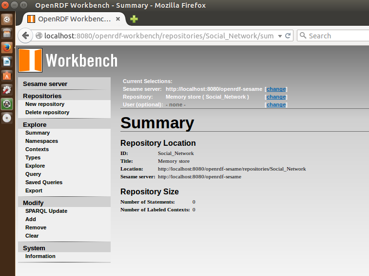

***

## 2) Añadir el fichero “Entidades.n3” al repositorio “SocialNetwork”

En la misma ventana del navegador web anterior:

- Pulsar en el menú "Repositories"
    - En la pantalla de listado que se abre, seleccionar el repositorio "SocialNetwork".

- Pulsar en el menú "Modify > Add" y en el nuevo formulario
    - Seleccionar:
        - RDF Data File: ... buscar y seleccionar el fichero "Entities_2v0.n3" proporcionado con el ejercicio ...
        - Data format: N3
    - Pulsar el botón [Upload]

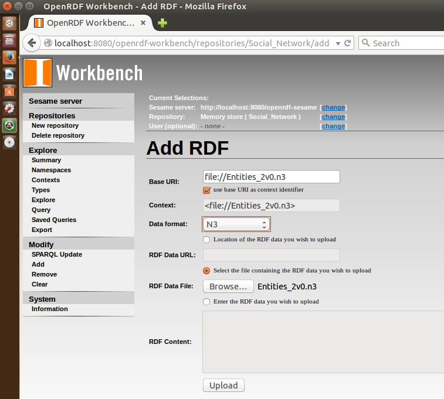

- Si todo ha ido bien aparecerá la pantalla con los datos del sumario del nuevo repositorio.

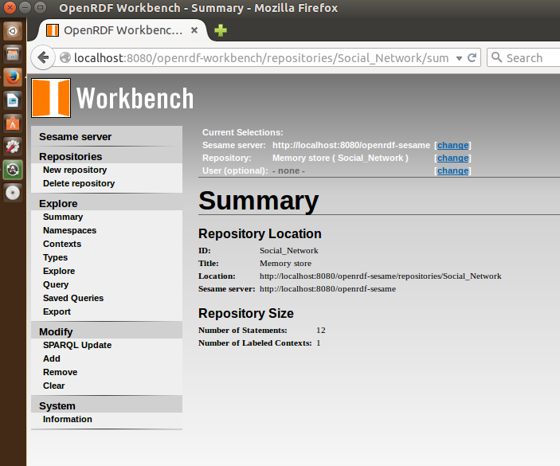

***

## 3) Enriquecer la instancia 2
Para la instancia 2 se procederá a enriquecer la información con información embebida en páginas HTML. Partiendo de la información que se habrá recopilado en el archivo “manuChao.n3”, proceder a volcarlo en el repositorio de SocialNetwork y hacer una query que liste los “MusicRecording”.
### 3.1) Buscar una página web con información de Manu Chao en el sitio web de la BBC:

En otra ventana del navegador web:

- Entrar en la web de la BBC:
    - [http://www.bbc.com/](http://www.bbc.com/)

- Usar el búscador para localizar "Manu Chao":
    - [http://www.bbc.co.uk/search?q=Manu%20Chao](http://www.bbc.co.uk/search?q=Manu%20Chao)

- Acceder a la sección de "Music":
    - [http://www.bbc.co.uk/search?q=Manu+Chao&filter=music&suggid=](http://www.bbc.co.uk/search?q=Manu+Chao&filter=music&suggid=)

- Seleccionar y cargar la página correspondiente a "Manu Chao":
    - [http://www.bbc.co.uk/music/artists/7570a0dd-5a67-401b-b19a-261eee01a284](http://www.bbc.co.uk/music/artists/7570a0dd-5a67-401b-b19a-261eee01a284)

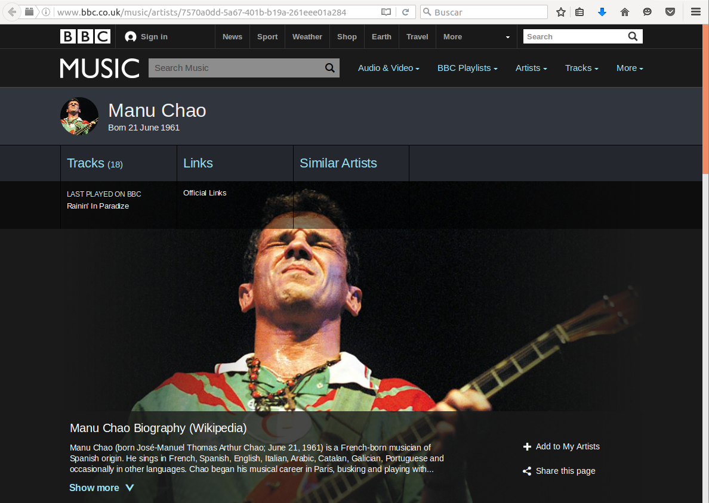

### 3.2) Extraer la información de la página web anterior:

En otra ventana del navegador web:

- Entrar en la web de la herramienta que permite obtener tripletas codificadas en RDFa a patir de una url:
    - [http://www.w3.org/2012/pyRdfa/Overview.html](http://www.w3.org/2012/pyRdfa/Overview.html)

- En el campo "URI" del tab "Distill by URI" poner la url anterior de Manu Chao en la web de la BBC:
    - [http://www.bbc.co.uk/music/artists/7570a0dd-5a67-401b-b19a-261eee01a284](http://www.bbc.co.uk/music/artists/7570a0dd-5a67-401b-b19a-261eee01a284)

- Seleccionar "Output Format: N Triples", pulsar [Go!] y guardar las tripletas encontradas en un archivo:
    - manuChao.n3

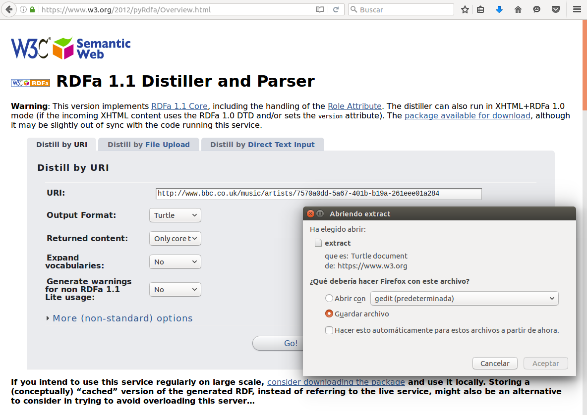

### 3.3) Cargar la información obtenida (fichero "manuChao.n3") en el repositorio “SocialNetwork”:

En la ventana del navegador con openrdf-workbench de nuestro servidor local:

- Pulsar en el menú "Repositories"
    - En la pantalla de listado que se abre, seleccionar el repositorio "SocialNetwork".

- Pulsar en el menú "Modify > Add" y en el nuevo formulario
    - Seleccionar / escribir:
        - RDF Data File: ... buscar y seleccionar el fichero "ManuChao.n3" descargado anteriormente...
        - Base URI: http://ciff.curso2015/ontologies/owl/socialNetwork#instancia2
        - Data format: N3
- Pulsar el botón [Upload]

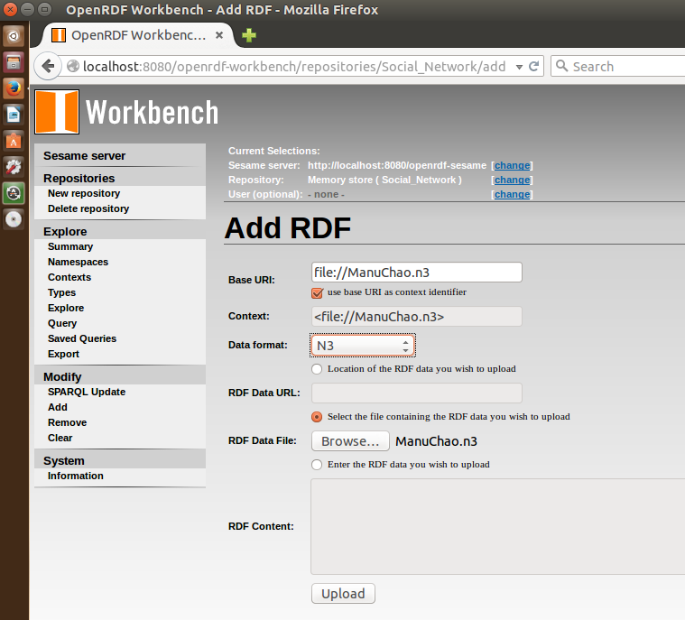

- Si todo ha ido bien aparecerá la pantalla con los datos del sumario del nuevo repositorio.
    - Number of Statements  198
    - Number of Labeled Contexts    2

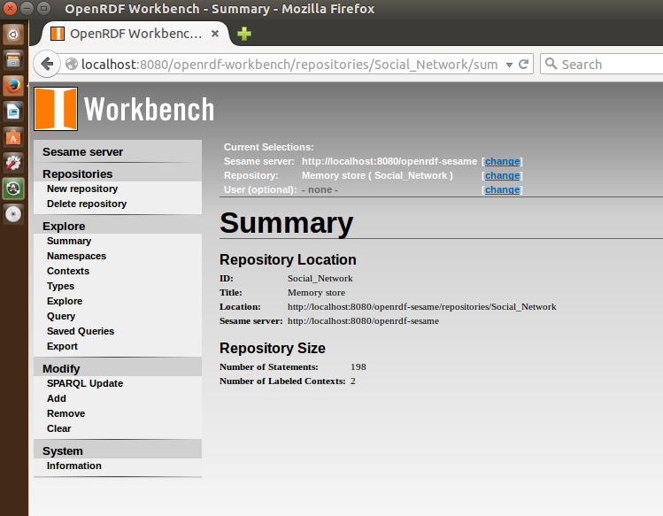

- Para comprobar la operación ralizada, pulsar en el menú "Explore" y en el nuevo formulario:
    - Escribir:
        - Resource: sn:instancia2
    - Pulsar [Enter]

- El listado mostrado es el siguiente:

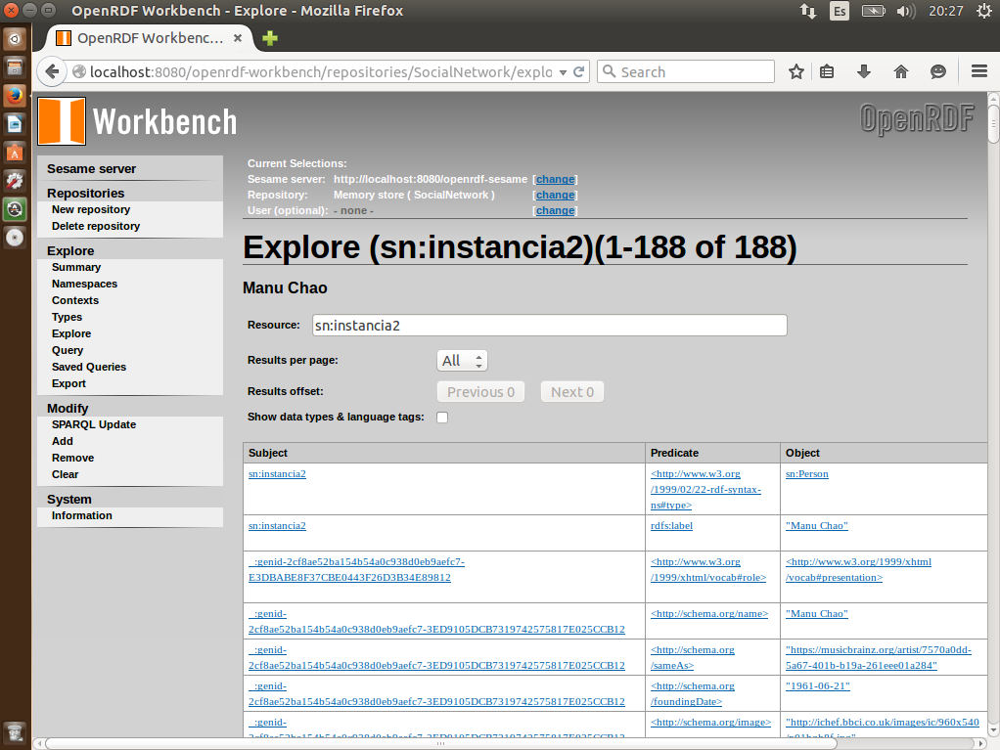

### 3.4) Consultar información de los "MusicRecording" en el repositorio enriquecido:

En la ventana del navegador con openrdf-workbench de nuestro servidor local:

- Pulsar en el menú "Query"
    - Escribir la siguiente consulta:
```
            PREFIX so: <http://schema.org/>

            SELECT ?temas
            WHERE
            {
            	?temas ?p so:MusicRecording
            }
```

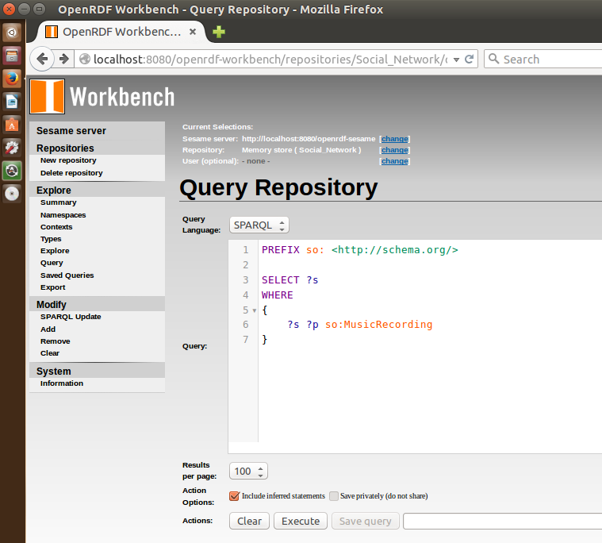

- Pulsar el botón [Execute] y aparecerá el siguiente listado de resultados:

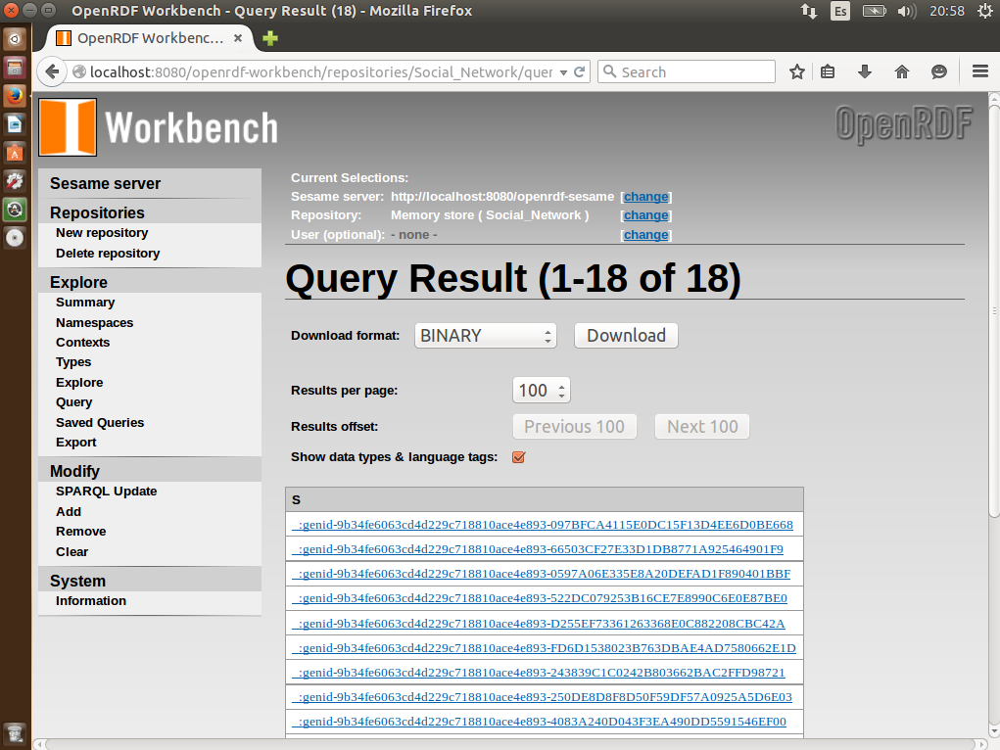

- Y si pulsamos en uno de los links, podremos acceder a la información del tema correspondiente:

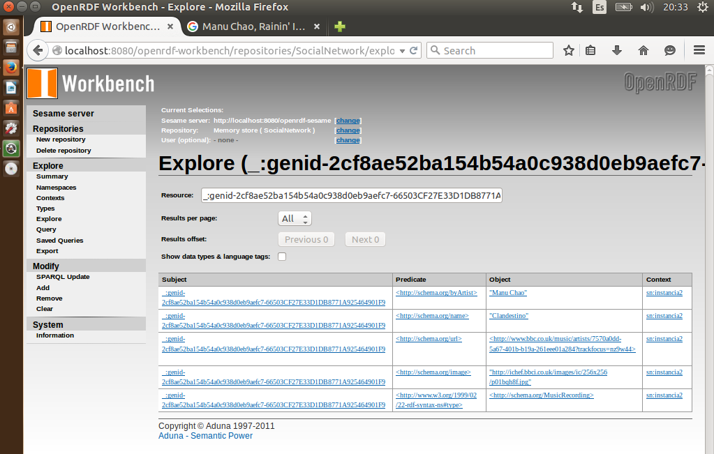

***

## 4) Partiendo del ejercicio 5_1, y según la lista de datasets sugeridos (ver más abajo), se determinará que propiedades nos interesa incorporar a nuestras entidades.

## 5) Enriquecer instancia1, instancia3 e instancia 4

Para la instancia1, instancia3 e instancia 4 se procederá a enriquecer la información con información de los datasets previamente recomendados de LOD Cloud. La información se recuperará programáticamente sirviéndose de fichero “enquierer.py” que hay en la carpeta de Ejercicio Final.

- a. En él se muestra los pasos inconclusos para la recuperación de información de dbpedia para enriquecer la instancia1. 
- b. Para proceder a enriquecer la instancia3, e insntacia4 se procederá a elaborar las SPARQL queries de los métodos “getLinkedmdbResource” y “getWebenemasunoResource”.
 
 
## 6) Para superar la prueba a nivel básico:

Para superar la prueba a nivel básico bastara con imprimir los recursos de los
repositorios remotos que coinciden con el label de mis instancias locales, esto
es:

- a. Para el caso de dbpedia y tal y como está definido, se obtiene el recurso “http://dbpedia.org/resource/Alicia_Keys” para la instancia 1.

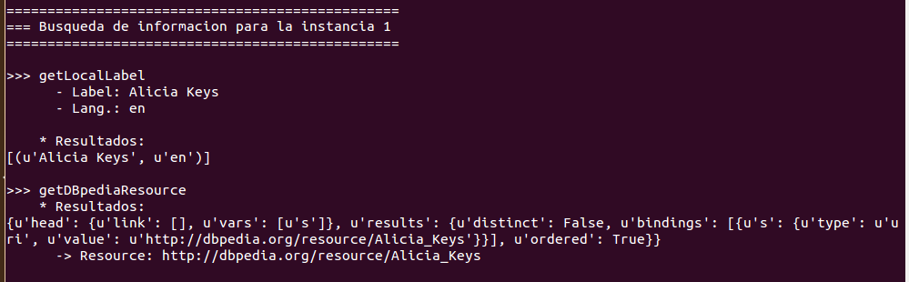

- b. Para el caso de Linkedmdb, se obtendrá aquella instancia (o instancias) cuyo nombre coincida con el (los) label de la instancia 3.

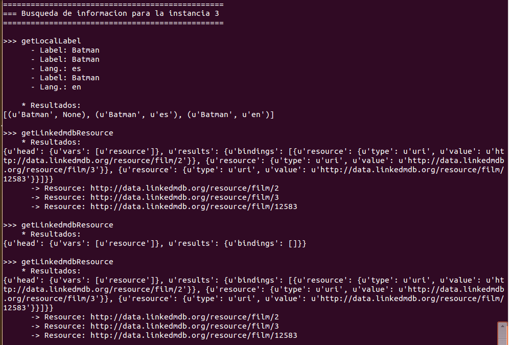

- c. Para el caso de WebN+1, se obtendrá aquella instancia (o instancias) cuyo nombre coincida con el (los) label de la instancia 4.

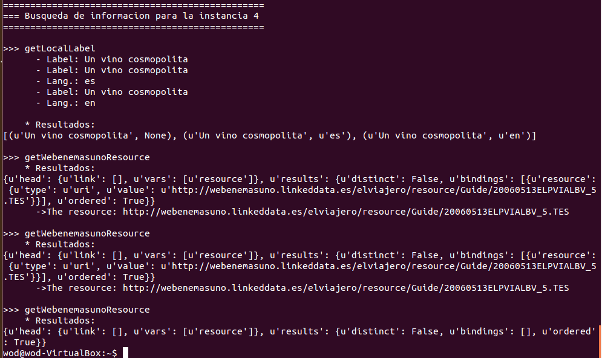

- [Script enquirer2.py](enquirer2.py)

- [Texto de salida por pantalla de ejecución del script](enquirer2_resultado.txt)

***

