***
# Web de Datos - Ejercicio final
***
- Autor: Juan A. García Cuevas
- Fecha: 30/06/2016

***

## 1) Crear en "Sesame" un nuevo repositorio llamado “SocialNetwork”

En una ventana del navegador web:

- Entrar en la página web del cliente "openrdf-workbench" instalado para nuestro servidor "Sesame" local:
    - [http://localhost:8080/openrdf-workbench/](http://localhost:8080/openrdf-workbench/)

- Pulsar el enlace "New Repository" del menú.

- En la ventana que se abre:
    - Seleccionar:
        - Type: In Memory Store
        - ID: "SocialNetwork"
    - Pulsar el botón [Next]

- En la nueva ventana:
    - Seleccionar:
        - Persist: Yes
    - Pulsar el botón [Create]

- Si todo ha ido bien aparecerá la pantalla con los datos del sumario del nuevo repositorio.
    - Number of Statements  0
    - Number of Labeled Contexts    0


***

## 2) Añadir el fichero “Entidades.n3” al repositorio “SocialNetwork”

En la misma ventana del navegador web anterior:

- Pulsar en el menú "Repositories"
    - En la pantalla de listado que se abre, seleccionar el repositorio "SocialNetwork".

- Pulsar en el menú "Modify > Add" y en el nuevo formulario:
    - Seleccionar:
        - RDF Data File: ... buscar y seleccionar el fichero "Entities_2v0.n3" proporcionado con el ejercicio ...
        - Data format: N3
    - Pulsar el botón [Upload]


- Si todo ha ido bien aparecerá la pantalla con los datos actualizados del sumario del repositorio.
    - Number of Statements  12
    - Number of Labeled Contexts    1


***

## 3) Enriquecer la instancia 2
Para la instancia 2 se procederá a enriquecer la información con información embebida en páginas HTML. Partiendo de la información que se habrá recopilado en el archivo “manuChao.n3”, proceder a volcarlo en el repositorio de SocialNetwork y hacer una query que liste los “MusicRecording”.

### 3.1) Buscar una página web con información de Manu Chao en el sitio web de la BBC:

En otra ventana del navegador web:

- Entrar en la web de la BBC:
    - [http://www.bbc.com/](http://www.bbc.com/)

- Usar el búscador para localizar "Manu Chao":
    - [http://www.bbc.co.uk/search?q=Manu%20Chao](http://www.bbc.co.uk/search?q=Manu%20Chao)

- Acceder a la sección de "Music":
    - [http://www.bbc.co.uk/search?q=Manu+Chao&filter=music&suggid=](http://www.bbc.co.uk/search?q=Manu+Chao&filter=music&suggid=)

- Seleccionar y cargar la página correspondiente a "Manu Chao":
    - [http://www.bbc.co.uk/music/artists/7570a0dd-5a67-401b-b19a-261eee01a284](http://www.bbc.co.uk/music/artists/7570a0dd-5a67-401b-b19a-261eee01a284)


### 3.2) Extraer la información de la página web anterior:

En otra ventana del navegador web:

- Entrar en la web de la herramienta que permite obtener tripletas codificadas en RDFa a patir de una url:
    - [http://www.w3.org/2012/pyRdfa/Overview.html](http://www.w3.org/2012/pyRdfa/Overview.html)

- En el campo "URI" del tab "Distill by URI" poner la url anterior de Manu Chao en la web de la BBC:
    - [http://www.bbc.co.uk/music/artists/7570a0dd-5a67-401b-b19a-261eee01a284](http://www.bbc.co.uk/music/artists/7570a0dd-5a67-401b-b19a-261eee01a284)

- Seleccionar "Output Format: N Triples", pulsar [Go!] y guardar las tripletas encontradas en un archivo:
    - manuChao.n3


### 3.3) Cargar la información obtenida (fichero "manuChao.n3") en el repositorio “SocialNetwork”:

En la ventana del navegador con openrdf-workbench de nuestro servidor local:

- Pulsar en el menú "Repositories"
    - En la pantalla de listado que se abre, seleccionar el repositorio "SocialNetwork".

- Pulsar en el menú "Modify > Add" y en el nuevo formulario:
    - Seleccionar / escribir:
        - RDF Data File: ... buscar y seleccionar el fichero "ManuChao.n3" descargado anteriormente...
        - Base URI: http://ciff.curso2015/ontologies/owl/socialNetwork#instancia2
        - Data format: N3
- Pulsar el botón [Upload]

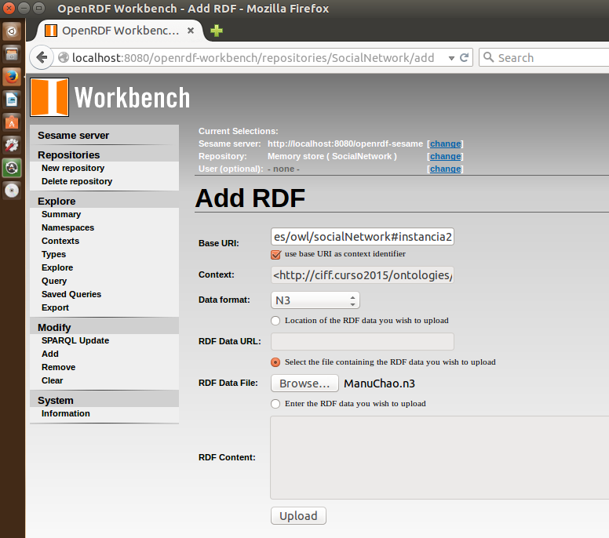

- Si todo ha ido bien aparecerá la pantalla con los datos del sumario del nuevo repositorio.
    - Number of Statements  198
    - Number of Labeled Contexts    2


- Para comprobar la operación ralizada, pulsar en el menú "Explore" y en el nuevo formulario:
    - Escribir:
        - Resource: sn:instancia2
    - Pulsar [Enter]

- El listado mostrado es el siguiente:


### 3.4) Consultar información de los "MusicRecording" en el repositorio enriquecido:

En la ventana del navegador con openrdf-workbench de nuestro servidor local:

- Pulsar en el menú "Query"
    - Escribir la siguiente consulta:
```
            PREFIX so: <http://schema.org/>

            SELECT ?temas
            WHERE
            {
            	?temas ?p so:MusicRecording
            }
```

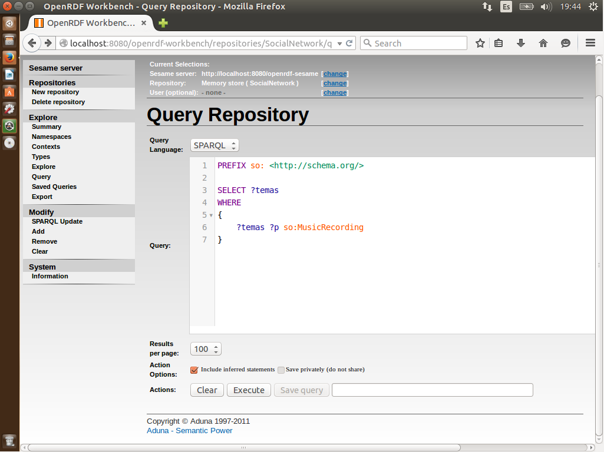

- Pulsar el botón [Execute] y aparecerá el siguiente listado de resultados:

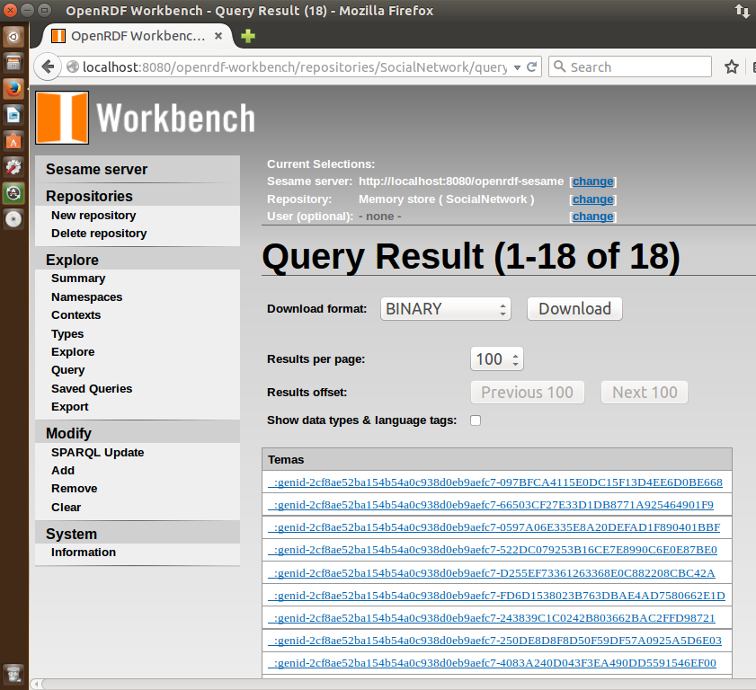

- Y si pulsamos en uno de los links, podremos acceder a la información del tema correspondiente:


***

## 4) Partiendo del ejercicio 5_1, y según la lista de datasets sugeridos (ver más abajo), se determinará que propiedades nos interesa incorporar a nuestras entidades.

### - BBPedia_ES

- SPARQL:
    - [http://es.dbpedia.org/sparql](http://es.dbpedia.org/sparql)

- Ejemplo:
    - [http://www.dbpedia.org/page/Alicia_Keys](http://www.dbpedia.org/page/Alicia_Keys)

- Propiedades que se podrían seleccionar:
    - dbo:abstract
    - dbo:birthDate
    - dbo:birthPlace
    - dbo:birthName
    - dbp:ocupation
    - dbp:yearsActive
    - foaf:homepage
    - ...

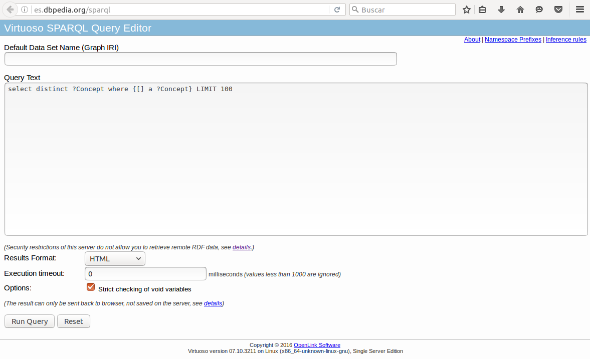

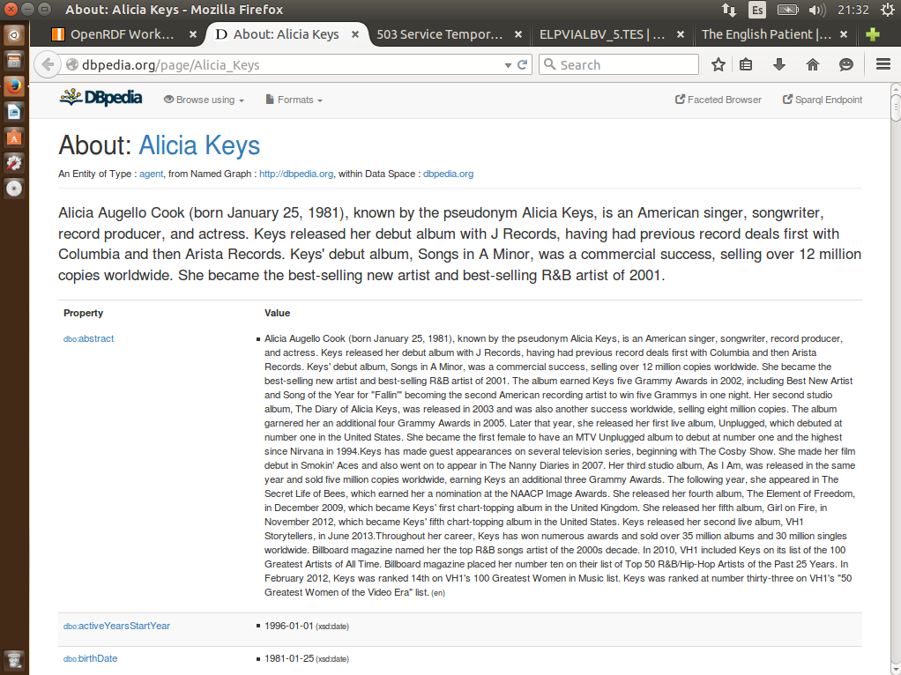

### - MusicBrainz

- SPARQL:
    - [http://dbtune.org/musicbrainz/sparql](http://dbtune.org/musicbrainz/sparql)
- Ejemplo:
    - [http://dbtune.org/musicbrainz/resource/artist/704acdbb-1415-4782-b0b6-0596b8c55e46](http://dbtune.org/musicbrainz/resource/artist/704acdbb-1415-4782-b0b6-0596b8c55e46)

- Propiedades que se podrían seleccionar:
    - _No se ha podido determinar, porque en el momento de hacer el ejercicio: Service Temporarily Unavailable_

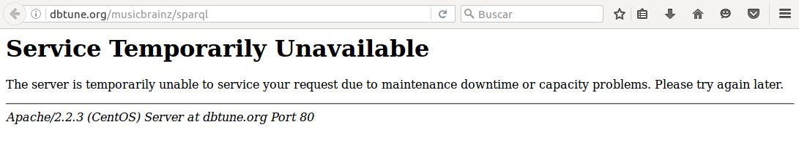

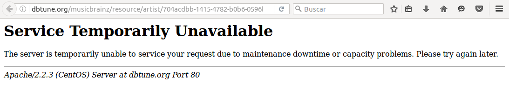

### - Web n+1 el viajero

- SPARQL:
    - [http://webenemasuno.linkeddata.es/sparql](http://webenemasuno.linkeddata.es/sparql)
- Ejemplo:
    - [http://webenemasuno.linkeddata.es/page/elviajero/resource/Guide/20060513ELPVIALBV_5.TES](http://webenemasuno.linkeddata.es/page/elviajero/resource/Guide/20060513ELPVIALBV_5.TES)

- Propiedades que se podrían seleccionar:
    - sioc:title
    - sioc:created_at
    - sioc:has_creator
    - opmo:content
    - opmopviajero:language
    - ...

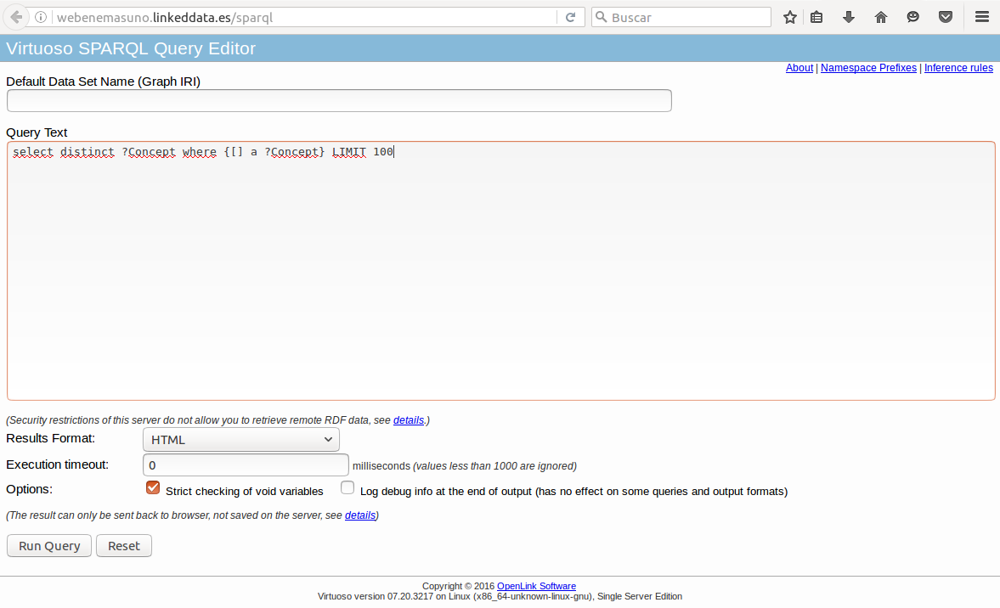

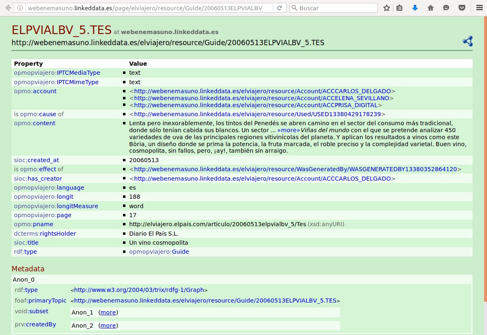

### - MDB

- SPARQL:
    - [http://data.linkedmdb.org/sparql](http://data.linkedmdb.org/sparql)
- Ejemplo:
    - [http://data.linkedmdb.org/page/film/2](http://data.linkedmdb.org/page/film/2)

- Propiedades que se podrían seleccionar:
    - dc:title
    - dc:date
    - movie:actor
    - movie:director
    - movie:initial_release_date
    - ...

> NOTA: La web de Batman es: http://data.linkedmdb.org/page/film/2

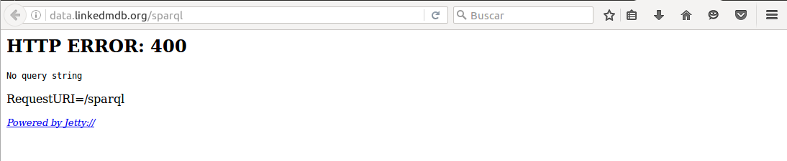

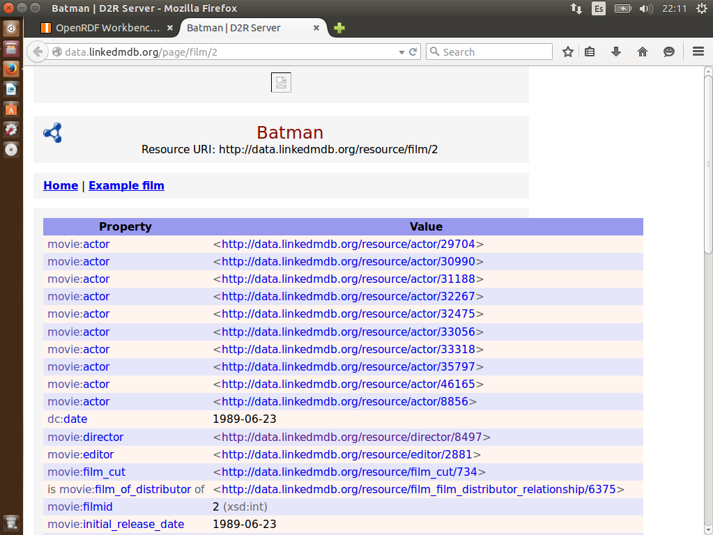


## 5) Enriquecer instancia1, instancia3 e instancia 4

Para la instancia1, instancia3 e instancia 4 se procederá a enriquecer la información con información de los datasets previamente recomendados de LOD Cloud. La información se recuperará programáticamente sirviéndose de fichero “enquierer.py” que hay en la carpeta de Ejercicio Final.

- a. En él se muestra los pasos inconclusos para la recuperación de información de dbpedia para enriquecer la instancia1.
- b. Para proceder a enriquecer la instancia3, e insntacia4 se procederá a elaborar las SPARQL queries de los métodos “getLinkedmdbResource” y “getWebenemasunoResource”.

> NOTA: sitio web en el que buscar PREFIX (Ej: opmo) para obtener su URI (http://openprovenance.org/model/opmo#)
>   http://prefix.cc/
>   Ej: PREFIX opmo:<http://openprovenance.org/model/opmo#>

Para este ejercicio he versionado el script original enquirer.py en este otro (enquirer2.py):

- [Script enquirer2.py](enquirer2.py)

- [Texto de salida por pantalla de ejecución del script enquirer2.py](enquirer2_resultado.txt)

## 6) Para superar la prueba a nivel básico:

Para superar la prueba a nivel básico bastara con imprimir los recursos de los
repositorios remotos que coinciden con el label de mis instancias locales, esto
es:

- a. Para el caso de dbpedia y tal y como está definido, se obtiene el recurso “http://dbpedia.org/resource/Alicia_Keys” para la instancia 1.


- b. Para el caso de Linkedmdb, se obtendrá aquella instancia (o instancias) cuyo nombre coincida con el (los) label de la instancia 3.


- c. Para el caso de WebN+1, se obtendrá aquella instancia (o instancias) cuyo nombre coincida con el (los) label de la instancia 4.


Para obtener la información mostrada en las capturas de pantalla anteriores hay que abrir un terminal y ejecutar el script de python [enquirer2.py](enquirer2.py) mediante la siguiente instrucción:
```bash
    python enquirer2.py
```

***

## 7) (Opcional – Nivel Medio). Se procederá a obtener alguna información extra (alguna propiedad) de los recursos obtenidos remotos.


Para este ejercicio he versionado el script original enquirer.py en este otro (enquirer3.py). En esta versión he modificado las query de SPARQL, y guardo los resultados en ficheros JSON.

- [Script enquirer3.py](enquirer3.py)

- [Texto de salida por pantalla de ejecución del script enquirer3.py](enquirer3_resultado.txt)

- [Fichero JSON para la instancia 1](instancia1.json)

- [Fichero JSON para la instancia 4](instancia4.json)

### - DBPedia_ES
```
    PREFIX rdfs: <http://www.w3.org/2000/01/rdf-schema#>
    PREFIX rdf: <http://www.w3.org/1999/02/22-rdf-syntax-ns#>
    PREFIX foaf: <http://xmlns.com/foaf/0.1/>
    PREFIX dbo: <http://dbpedia.org/ontology/>
    SELECT ?s
           ?birthDate
           ?birthPlace
           ?birthName
           ?abstract
    WHERE {
     	   ?s dbo:birthDate ?birthDate.
    	   ?s dbo:birthPlace ?birthPlace.
    	   ?s dbo:birthName ?birthName.
    	   ?s dbo:abstract ?abstract.
    	   ?s rdfs:label "Alicia Keys"@es.
    	   ?s rdf:type foaf:Person
    }
```
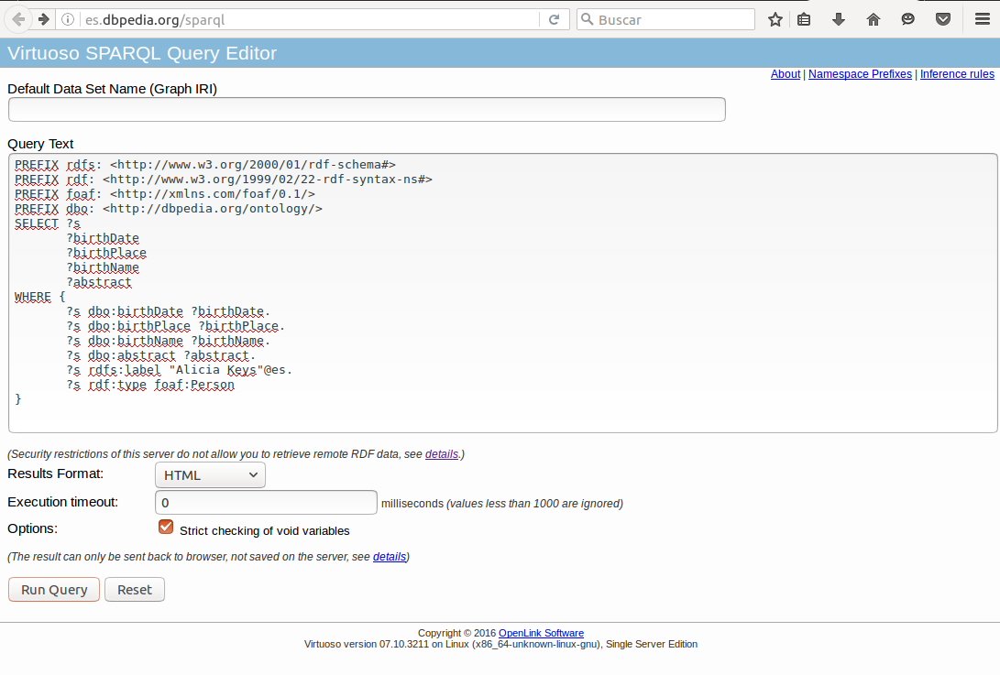


### - MusicBrainz

>NOTA: E servicio no está disponible

### - Web n+1 el viajero
```
    PREFIX sioc:<http://rdfs.org/sioc/ns#>
    PREFIX opmopviajero:<http://webenemasuno.linkeddata.es/ontology/OPMO/>
    PREFIX opmo:<http://openprovenance.org/model/opmo#>
    SELECT
    	?title
    	?created_at
    	?has_creator
    	?content
    	?language
    WHERE {
    	?s sioc:title ?title.
    	?s sioc:created_at ?created_at.
    	?s sioc:has_creator ?has_creator.
    	?s opmo:content ?content.
    	?s opmopviajero:language ?language.
    	?s sioc:title "Un vino cosmopolita".
    	?s opmopviajero:language "es"
}
```
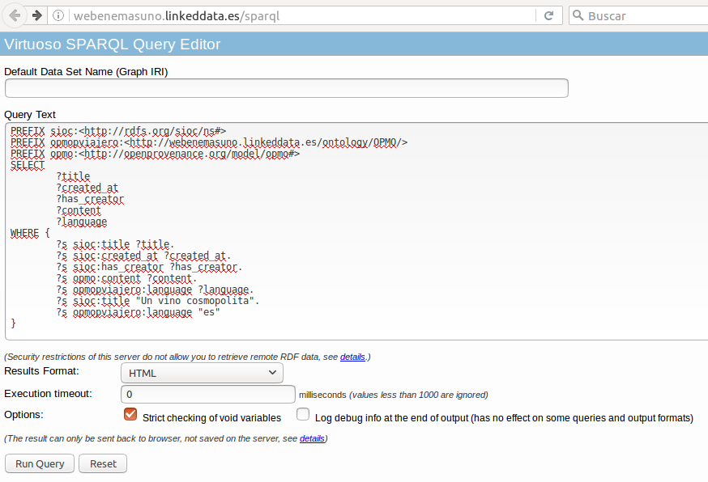

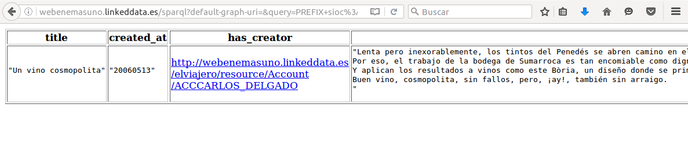
```

***

## 8) (Opcional – Nivel Alto). Insertar las tripletas obtenidas con el enquierer en el repositorio SocialNetwork:

- a. Volcar las tripletas a un fichero y volcarlas al repositorio SocialNetwork via el workbench
- b. O insertarlas directamente en el repositorio mediante la librería SPARQLWrapper.

***
